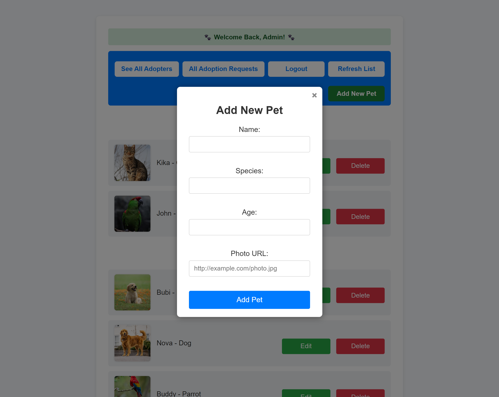
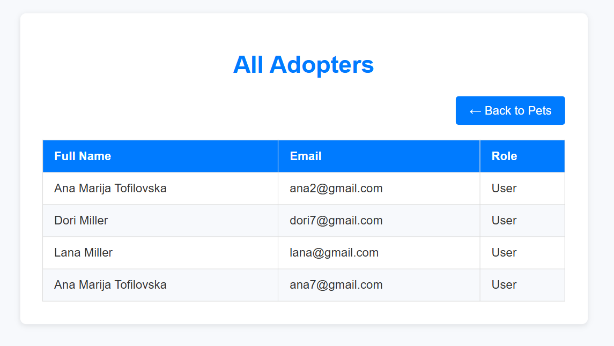

# PetAdoptionSystem

PetAdoptionSystem is a full-stack web application for managing pet adoptions. It uses an ASP.NET Core Web API backend (.NET 8.0) with a frontend built in HTML, CSS, and JavaScript served from the backend’s `wwwroot` folder.

---

## Table of Contents

- [Project Overview](#project-overview)  
- [Features](#features)  
- [Technology Stack](#technology-stack)  
- [Project Structure](#project-structure)  
- [Prerequisites](#prerequisites)  
- [Setup and Run](#setup-and-run)  
- [Usage](#usage)  
- [Contributing](#contributing)  
- [License](#license)  
- [Contact](#contact)  

---

## Project Overview

Users can register, log in, view available pets, and submit adoption requests. Admin users manage pets and adoption requests, approving or rejecting them, with email notifications triggered upon approval.

---

## Features

- User registration and login  
- Browse and search pets  
- Submit and track adoption requests  
- Admin dashboard for pet and request management  
- Email notifications for adoption approvals  
- User profile management  
- Role-based access control  

---

## Technology Stack

- Backend: ASP.NET Core Web API 8.0 (.NET 8.0)  
- Frontend: HTML, CSS, JavaScript (served from `wwwroot`)  
- Database: PostgreSQL  
- ORM: Entity Framework Core  
- Testing: xUnit  

---

## Project Structure

```

PetAdoptionSystem/
│
├── Controllers/          # API controllers
├── Data/                 # Database context and migrations
├── DTOs/                 # Data transfer objects
├── Migrations/           # EF Core migration files
├── Models/               # Entity models
├── Repositories/         # Data access layer
├── Services/             # Business logic services
├── wwwroot/              # Frontend static files
├── Properties/           # Project properties
├── appsettings.json      # Configuration
├── Program.cs            # Application entry point
├── PetAdoptionSystem.sln # Solution file
└── PetAdoptionSystem.Tests/ # Unit tests

````

---

## Prerequisites

- [.NET 8.0 SDK](https://dotnet.microsoft.com/en-us/download/dotnet/8.0)  
- [PostgreSQL](https://www.postgresql.org/download/)  

> **Important:** Update your database connection string in `appsettings.json` with your own credentials. 

Example connection string format:

```json
"ConnectionStrings": {
  "DefaultConnection": "Host=localhost;Port=5432;Database=PetAdoptionDB;Username=your_username;Password=your_password"
}
````

---

## Setup and Run

1. **Clone the repository:**

```bash
git clone https://github.com/EmaPeeva/PetAdoptionSystem.git
cd PetAdoptionSystem
```

2. **Restore dependencies and build the project:**

```bash
dotnet restore
dotnet build
```

3. **Apply database migrations:**

```bash
dotnet ef database update
```

4. **Run the application:**

```bash
dotnet run
```


## Usage

* **Users:** Register, log in, browse pets, submit adoption requests, and manage profiles.
* **Admins:** Manage pets and adoption requests, approve/reject requests, and trigger notification emails.

---
## 📸 Screenshots

### 🔑 Register Page


### 🔐 Login Page


### 🐾 User - Main View (Pet List)


### 📋 User - Adoption Requests


### 🙍‍♀️ User - Profile


---

### 🛠️ Admin - Main Dashboard


### 📑 Admin - All Adoption Requests


### 📄 Admin - Add New Pet


### ✏️ Admin - Edit Pet


### 👥 Admin - All Adopters


## Contributing

Contributions are welcome! Please fork the repository and submit a pull request.

---

## License

 MIT License

---

## Contact

For questions or suggestions, please open an issue or contact via GitHub profile:
[https://github.com/EmaPeeva](https://github.com/EmaPeeva) 

---

*Thank you for visiting the PetAdoptionSystem repository!*

```


